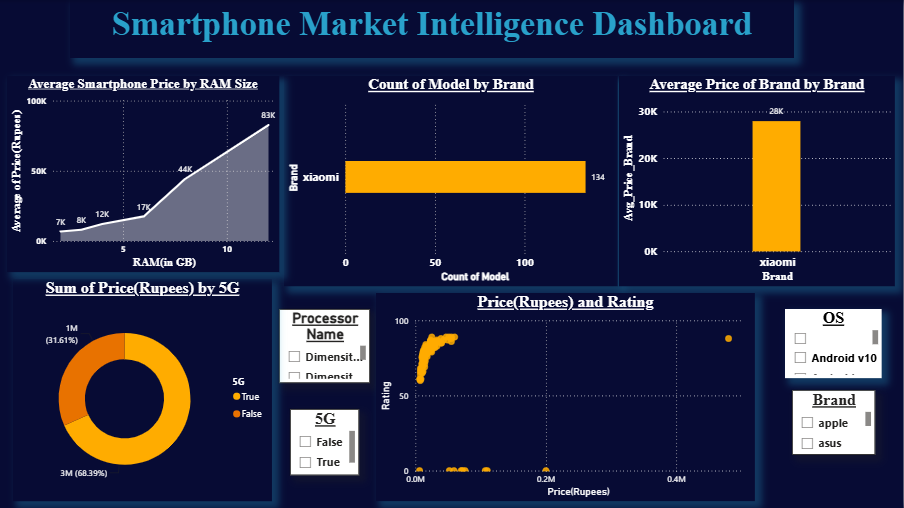

# 📱 Smartphone Market Intelligence Dashboard

## Overview

This project presents an interactive Power BI dashboard developed to analyze trends in the smartphone market using a dataset containing approximately 984 smartphone models.

The dashboard enables users to explore smartphone pricing, RAM configurations, brands, operating systems, processors, ratings, and 5G availability through interactive visualizations.

---

## Dashboard Preview

---

## Objectives

- Analyze smartphone pricing trends.
- Compare brands based on average pricing.
- Study RAM and price relationships.
- Analyze smartphone ratings.
- Compare 5G vs Non-5G smartphones.
- Build an interactive business intelligence dashboard.

---

## Tools Used

- Microsoft Power BI
- Microsoft Excel
- Data Visualization
- Business Intelligence
- Data Analytics

---

## Dashboard Features

- Average Price by RAM
- Brand-wise Smartphone Count
- Average Brand Price
- 5G Distribution
- Price vs Rating Scatter Plot
- Interactive Filters
- Processor Filter
- Brand Filter
- Operating System Filter

---

## Skills Demonstrated

- Data Cleaning
- Dashboard Design
- Data Visualization
- KPI Development
- Business Intelligence
- Analytical Thinking

---

## Repository Contents

- Power BI Dashboard (.pbix)
- Project Report
- Dashboard Screenshot

---

## Dataset Note

This project was originally developed in 2025 using a smartphone dataset containing approximately 984 smartphone models.

The original dataset is no longer available; therefore, only the Power BI dashboard, project report, and dashboard preview are included in this repository.

---

## Author

**Madhav Verma**

Economics Undergraduate

Aspiring Data Analyst

Power BI | SQL | Excel | Python
